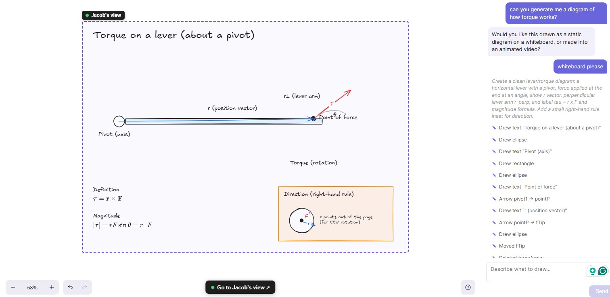

# Jacob V2
TODO: 
* MAKE IT SO THE FIRST MESSAGE IS RESPONDING TO THE REQUEST. NOT FILLER
* MAKE IT SO THAT WHEN THE LESSON IS OVER, THE AGENT LETS THE USER KNOW ("THAT CONCLUDES THE LESSON") OR SUM LIKE THAT
* MAKE SURE IT USES ANALAGIES


An AI-powered visualization studio. Describe a concept in plain language and the app decides the best way to show it: a clean **whiteboard diagram**, an **animated Manim video**, or an **interactive 2D/3D graph**, then builds it for you in real time.

The successor to [Jacob V1](https://github.com/kaidensimon/Jacob).

---

## What it does

A reasoning **orchestrator** reads your message and routes it to the right tool:

| Intent | Result |
| --- | --- |
| "Draw a login flow" / "diagram this" | A streamed **Excalidraw** diagram, drawn shape-by-shape |
| "Animate the Pythagorean theorem" | A rendered **Manim** video (mp4) |
| "Graph `z = x² − y²`" | An interactive **Plotly** 2D/3D plot |
| "hi" / general question | A normal chat reply |

Highlights:

- **Streaming whiteboard agent**: the model emits structured actions (`think`, `create`, `update`, `align`, `stack`, `graphRef`…) over SSE that are applied to the canvas live, including real typeset math (LaTeX/MathJax).
- **Self-correcting Manim agent**: generates Manim Community code, renders it, and feeds render errors back to the model to retry until it produces a clean video.
- **Accurate graphing tools**: curves, surfaces, and regions of integration are plotted deterministically so the agent traces correct geometry instead of free-handing it.
- **Independent agent "camera"**: the agent has its own viewport and can pan/zoom to review and refine its work.
- **Accounts + dashboard**: JWT auth, saved whiteboards, and a gallery of generated animations.

---

## Voice lesson demo

Turn on **Voice Tutor Mode** and ask Jacob to teach you something — he plans a
multi-section lesson and draws it on the whiteboard while narrating, in sync,
with a live talking sprite.

[](https://www.youtube.com/watch?v=JC6m4VCns-0)

[Watch the voice lesson demo](https://www.youtube.com/watch?v=JC6m4VCns-0)

---

## Example: generated Manim video

<video src="example_video.mp4" controls width="100%"></video>

[Watch the example video](example_video.mp4)

---

## Example: generated diagram



_From the prompt "can you generate me a diagram of how torque works?": the agent draws a labeled lever diagram, typeset torque equations, and a right-hand-rule direction inset._

---

## Architecture

```
frontend/   React + TypeScript + Vite
            ├─ Excalidraw + tldraw canvas
            ├─ Plotly (2D/3D graphing)
            └─ MathJax / mathjs (typeset + evaluate math)

backend/    Django + Django REST Framework
            ├─ orchestrator.py        routes intent (chat / whiteboard / manim / grapher)
            ├─ excalidraw_agent.py    streaming diagram agent (SSE)
            ├─ manim_agent.py         generates + renders animation videos
            ├─ grapher_vision.py      reads/plots equations
            └─ JWT auth + SQLite + saved sessions
```

The agents are powered by the OpenAI API.

---

## Getting started

### Prerequisites

- Python 3.11+
- Node.js 18+
- An OpenAI API key
- [Manim Community](https://docs.manim.community/) + FFmpeg (required for video generation)

### Backend

```bash
cd backend
python -m venv .venv
source .venv/bin/activate        # Windows: .venv\Scripts\activate
pip install -r requirements.txt

cp .env.example .env             # then add your OPENAI_API_KEY

python manage.py migrate
python manage.py runserver
```

The API runs at `http://localhost:8000`.

### Frontend

```bash
cd frontend
npm install
npm run dev
```

The app runs at `http://localhost:5173`.

---

## Key API endpoints

| Endpoint | Purpose |
| --- | --- |
| `POST /api/orchestrator/` | Decide what to do with a user message |
| `POST /api/excalidraw/stream/` | Stream whiteboard drawing actions (SSE) |
| `POST /api/manim/generate/` | Generate + render an animation video |
| `POST /api/grapher/read-image/` | Read/plot a math expression |
| `POST /api/auth/login/` · `register/` | JWT authentication |
| `GET  /api/whiteboards/list/` · `/api/manim/list/` | Saved sessions & animations |

---

## Configuration

Set in `backend/.env`:

```
OPENAI_API_KEY=sk-...
```

Generated videos are written to `backend/media/` and served from `/media/`.
